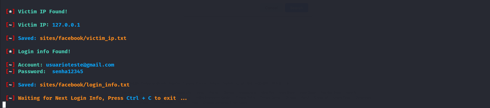
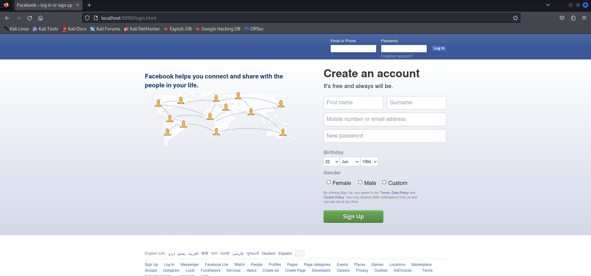

# Facebook Phishing Tool

Ferramenta de Phishing para o Facebook


**🇧🇷 Português**

## 📝 Descrição

Este projeto utiliza o **ShellPhish** para simular uma página de login do Facebook, visando demonstrar como ataques de phishing podem ser realizados para obter informações de login de usuários desavisados.

💡 A ferramenta **Setoolkit** também pode ser utilizada para simulações de phishing!

## ❓ O que foi feito

- Configuração do ShellPhish para criar uma réplica da página de login do Facebook.
- Implementação de um servidor que hospeda a página falsa.
- Coleta de credenciais inseridas pelos usuários na página simulada.

**Shellphish**

A ferramenta ShellPhish é uma plataforma de automação para simulação de ataques de phishing. Ela cria réplicas de páginas de login de sites populares, como Facebook, Instagram e outros, gerando links para enganar usuários e capturar credenciais inseridas. É amplamente utilizada para testes de conscientização em segurança, mas também requer responsabilidade, pois seu uso inadequado pode ser ilegal.

**login_info.txt**

Após capturar as credenciais, a ferramenta faz um "relatório" com o login e senha obtidos. Esse arquivo pode ser obtido no dentro do diretório da página clonada na pasta "site".




## 🔥 Resumo

**Ambiente**


**Arquivos**

- *ShellPhish* (ferramenta)
- *login_info.txt* (resultado obtido)

## 🖥 Como usar

Clone este repositório:
```bash
git clone https://github.com/JSalvadorNET/phishing-facebook.git
cd phishing-facebook
```
Certifique-se de que você tem Python 3 instalado.
Instale as dependências necessárias (se houver).

Vá até o diretório onde a aplicação está:
```bash
cd Phishing-linux/tools/ShellPhish
```
Execute o Shellphish para inicializar a ferramenta:
```bash
bash shellphish.sh
```


Com a ferramenta aberta, vamos criar um link local para que a vítima acesse o site falso. Escolha a opção equivalente ao "Facebook" e selecione "Traditional Login Page".


Selecione a opção de usar o localhost como meio de exibição web e selecione a porta 5050.


Abra um navegador e acesse "http://localhost:5050" para visualizar a página falsa. Insira as credenciais e veja o que a ferramenta capturou ;)




##

**🇺🇸 English**

## 📝 Description

This project uses **ShellPhish** to simulate a Facebook login page, demonstrating how phishing attacks can be performed to obtain login information from unsuspecting users.

💡 The **Setoolkit** tool can also be used for phishing simulations!

## ❓ What was done

- Configured ShellPhish to create a replica of the Facebook login page.
- Implemented a server to host the fake page.
- Collected credentials entered by users on the simulated page.

**Shellphish**

ShellPhish is an automation platform for simulating phishing attacks. It creates replicas of login pages from popular websites like Facebook, Instagram, and others, generating links to deceive users and capture entered credentials. It is widely used for security awareness testing but requires responsibility, as improper use may be illegal.

**login_info.txt**

After capturing credentials, the tool generates a "report" with the obtained login and password. This file can be found in the cloned page's directory under the "site" folder.


## 🔥 Summary

**Environment**


**Files**

- ShellPhish (tool)
- login_info.txt (captured results)

## 🖥 How to use

Clone this repository:
```bash
git clone https://github.com/JSalvadorNET/phishing-facebook.git
cd phishing-facebook
```
Ensure that Python 3 is installed.
Install any necessary dependencies (if applicable).

Navigate to the application directory:
```bash
cd Phishing-linux/tools/ShellPhish
```
Run ShellPhish to initialize the tool:
```bash
bash shellphish.sh
```


With the tool open, create a local link for the victim to access the fake site. Select the option corresponding to "Facebook" and choose "Traditional Login Page."


Select the option to use localhost as the web display method and set the port to 5050.


Open a browser and access "http://localhost:5050" to view the fake page. Enter credentials to see what the tool captures ;)


